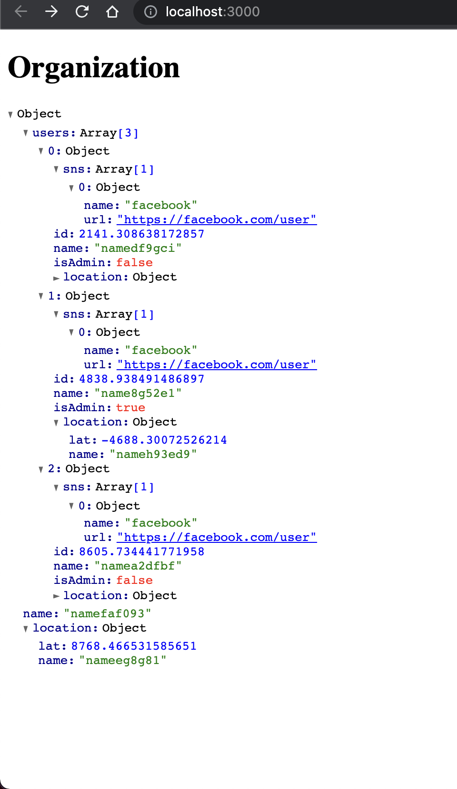

# What is this?

A sample project for automatically generating factory based on type definition.
Uses [ts-auto-mock](https://github.com/Typescript-TDD/ts-auto-mock) for mocking and [fishery](https://github.com/thoughtbot/fishery) for implementing factory with traits.



## Basic Idea

Given a type definition like this:

```typescript
export type Organization = {
    name: string
    users: User[]
    location: Location
}

export type User = {
    id: number
    name: string
    isAdmin: boolean
    location: Location
    organization?: Organization
    phoneNumber?: string
    sns: SNS[]
}

export type Location = {
    lat: number
    name: string
}

export type SNS = {
    name: string
    url: string
}
```

One can easily create a factory that automatically mock properties that has primitive types.

```typescript

// traits are available too!
class UserTraits extends Factory<User>{
    admin() {
        return this.params({
            isAdmin: true,
        });
    }
    withPhoneNumber() {
        return this.params({
            phoneNumber: '123000',
        });
    }
    withFacebook() {
        return this.params({
            sns: [
                {
                    name: 'facebook',
                    url: 'https://facebook.com/user',
                }
            ]
        })
    }
}

export const UserFactory = UserTraits.define(() => (createMock<User>()));

//usage
UserFactory.build(); // -> this will simply build a user object with default properties

UserFactory.buildList(3) // -> this will build a list of user objects

UserFactory
    .admin()
    .withPhoneNumber()
    .withFacebook()
    .buildList(3);
// Above will build a list of user objects with admin, phoneNumber and facebook

```

And one can just easily use sub factories to create complex objects.

```typescript
class OrganizationTraits extends Factory<Organization> {
    withUsers(n: number) {
        return this.params({
            users: UserFactory.withFacebook().buildList(n),
        })
    }
}

const OrganizationFactory = OrganizationTraits.define(() => createMock<Organization>());

// usage

OrganizationFactory.withUsers().build();
```
